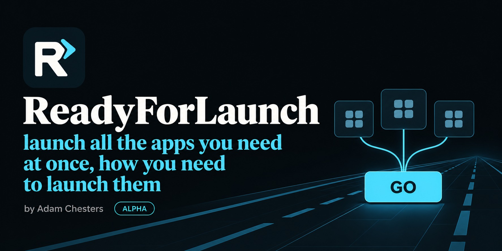

<p align="center">
  
</p>

# ReadyForLaunch

**Intended for flight sims, usable for anything**

By **Adam Chesters ([AdamChesters](https://github.com/AdamChesters))**.

> **ALPHA — 0.2.0-alpha.1 is early test software.** Expect bugs and incomplete app compatibility. Verify your own launch stack and keep a backup of your profiles before relying on it. Process/window detection does not prove a simulator or headset is ready. Stop is a best-effort close request; apps may remain running. This build is unsigned.

Choose a profile, arrange your apps, and press **GO**. Independent groups start together; each follows its own sequence. A group can also wait for another group.

[Download the Windows x64 alpha](https://github.com/AdamChesters/ReadyForLaunch/releases/tag/v0.2.0-alpha.1) · [Quick guide](docs/USER-GUIDE.md) · [Changes](CHANGELOG.md)

Use the per-user **Setup.exe**, or extract the portable ZIP and run `ReadyForLaunch.exe`. Starter profiles are empty until you add your apps. The top-right version indicator checks GitHub Releases and offers verified updates.


## Features

- **Running apps** comes first: choose visible application windows, without services, hidden helpers, tray-only apps, or tool windows.
- Also choose from **Steam**, **Installed apps**, or **Browse EXE**, in that order.
- Run groups together or **After group…**. Set rows to **On GO**, with the previous app, after it starts, after a delay, or after a helper finishes.
- Detect already-running apps, skip a duplicate launch, and show a warning in the scrollable **Status** window.
- Glass-style status lights beside each row's status: off when not running, green when running, yellow while queued.
- DCS World, MSFS 2024, MSFS 2020, X-Plane 12, and IL-2 starter profile buttons, plus custom profiles. Right-click to rename, copy from/to, or delete.
- Stable Discord/Squirrel launch targets that survive version-folder updates.
- **Open target folder** from an app's menu; **Help** includes the approved mockup and a short guide.
- **Stop** asks identified session apps to close, including reused instances. There is no force-kill control.
- A compact native Windows interface and original icon in the PSVR2SimShaker visual style.

## Alpha limits

Steam and Windows apps can launch through another process. ReadyForLaunch requests shutdown only when it can identify the actual target; unresolved apps require manual closure. Apps may ignore close requests, prompt about unsaved work, or hide to the tray.

Readiness uses process detection, a responding window, successful helper completion, or manual confirmation. Actual flight sim/headset sequences still need live testing. No automatic VR2JB preset, firmware changes, or headset configuration are included. See [verification and remaining tests](docs/TESTING.md).

Profiles autosave under `%LOCALAPPDATA%\ReadyForLaunch`. Installer updates preserve that folder. The alpha reads first-preview settings and writes schema 2; back up before returning to an older build.

## V2 follow-up

Remember each profile's app window positions, sizes, monitor assignments, and window states. An **Update state** button will capture the arrangement for restoration on later launches. This is planned, not implemented. See the [v2 requirement](docs/PLAN.md#10-v2--remember-and-restore-window-state).

## Build

Use Visual Studio C++ tools, CMake, and vcpkg. The preset targets Visual Studio 2026; CI builds with the Windows 2025 runner's Visual Studio 2022 tools. Set `VCPKG_ROOT`, then:

```powershell
cmake --preset windows
cmake --build --preset release
ctest --preset release
./scripts/package.ps1 -BuildDirectory build -OutputDirectory dist
```

Packaging needs Inno Setup 6.3+; use `-SkipInstaller` for only a portable ZIP. With a preinstalled dependency tree, configure using `-DCMAKE_PREFIX_PATH=<x64-windows-static>` without the vcpkg toolchain. Dependencies are pinned in `vcpkg.json`.

Licensed under **GPL-3.0**. The updater is adapted from [PSVR2SimShaker](https://github.com/AdamChesters/PSVR2SimShaker); see [third-party notices](THIRD_PARTY_NOTICES.md).

## Design documents

- [Implementation plan and v2 scope](docs/PLAN.md)
- [Name check and technical research](docs/RESEARCH.md)
- [Original JPG mockup](docs/mockups/readyforlaunch-ui.jpg) and [generation prompt](docs/MOCKUP-PROMPT.md)
- [Icon assets and generation provenance](assets/README.md)

Application names in the screenshots illustrate a user-configured stack. They do not indicate bundled software or verified integrations.
