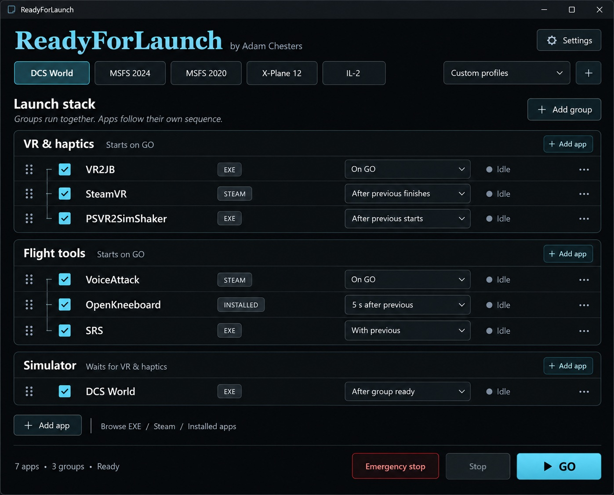

# ReadyForLaunch

A compact Windows flight sim app launcher and session manager, by **Adam Chesters ([AdamChesters](https://github.com/AdamChesters))**.

Choose a simulator profile, arrange your companion apps, and press **GO**. Independent groups start together; each group follows its own app sequence.

**Status: planning and UI concept.** This repository currently contains the proposed product design, implementation plan, research, and JPG mockup. A runnable application has not been built yet.

## Planned first version

- Add apps by browsing to an EXE, selecting a Steam app, or choosing from Windows' app list.
- Reorder and enable individual apps; organise them into parallel launch groups.
- Set a group's first task to **After group…** to chain whole groups in order, such as VR → Flight tools → Simulator.
- Start with the previous app, after it starts, or after a chosen delay. Support successful completion for one-shot helpers such as VR2JB.
- Simulator profile buttons for DCS World, MSFS 2024, MSFS 2020, X-Plane 12, and IL-2; custom profiles in a dropdown.
- **GO**, graceful **Stop**, and **Emergency stop** for processes tracked as belonging to the current session.
- A compact interface following PSVR2SimShaker's dark teal theme.

## V2 follow-up

Remember each profile's app window positions, sizes, monitor assignments, and window states. An **Update state** button captures the arrangement for restoration on later launches. See the [v2 requirement](docs/PLAN.md#10-v2--remember-and-restore-window-state).

## Design documents

- [Implementation plan](docs/PLAN.md)
- [Name check and technical research](docs/RESEARCH.md)
- [Download the JPG mockup](docs/mockups/readyforlaunch-ui.jpg)
- [Mockup generation prompt and provenance](docs/MOCKUP-PROMPT.md)

Application names in the mockup illustrate a user-configured stack. They do not indicate bundled software or verified integrations. The initial repository is private while the design is being developed.

Project attribution: Adam Chesters / AdamChesters, 2026.
