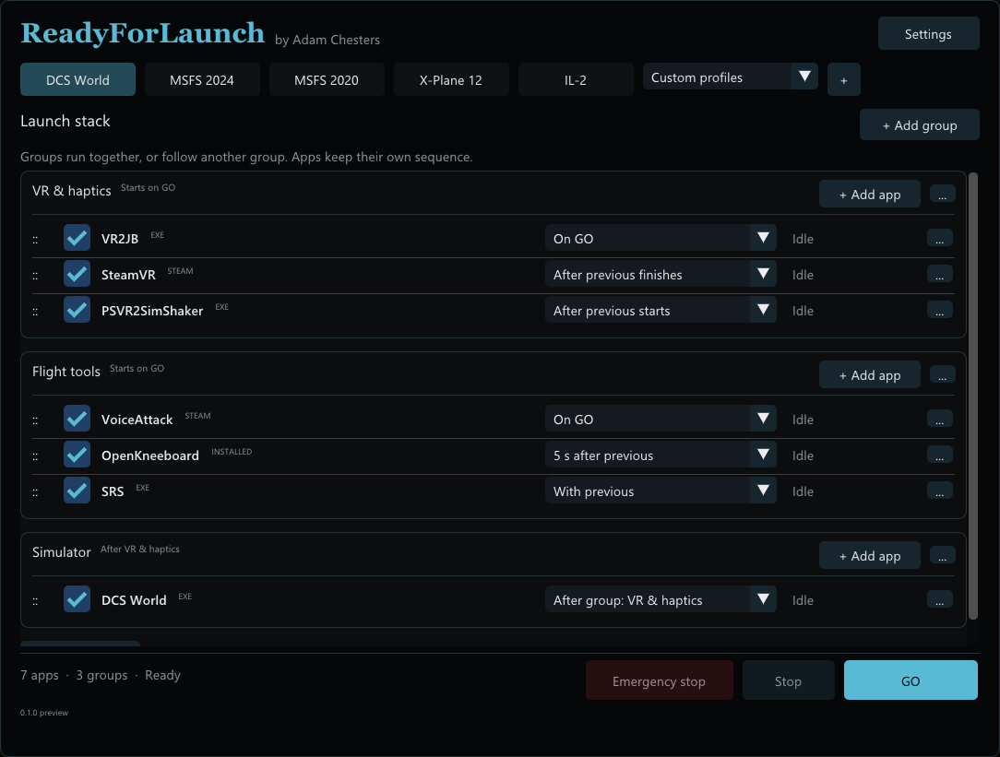

# ReadyForLaunch

A compact Windows flight sim app launcher and session manager, by **Adam Chesters ([AdamChesters](https://github.com/AdamChesters))**.

Choose a simulator profile, arrange your companion apps, and press **GO**. Independent groups start together; each group follows its own app sequence.

**0.1.0 — first Windows x64 preview.** Extract the portable ZIP and run `ReadyForLaunch.exe`. Starter profiles are empty until you add your apps. Read the [quick guide](docs/USER-GUIDE.md) before configuring your VR chain.



## Features

- The default **Running apps** picker shows apps with visible windows and excludes services, hidden helpers, tray-only apps, and tool windows.
- Also add apps by browsing to an EXE, selecting a Steam app, or choosing from Windows' app list.
- Reorder and enable individual apps; organise them into parallel launch groups.
- Set a group's first task to **After group…** to chain whole groups in order, such as VR → Flight tools → Simulator.
- Start with the previous app, after it starts, or after a chosen delay. Support successful completion for one-shot helpers such as VR2JB.
- Simulator profile buttons for DCS World, MSFS 2024, MSFS 2020, X-Plane 12, and IL-2; custom profiles in a dropdown.
- **GO**, graceful **Stop**, and **Emergency stop** for directly launched EXEs and their tracked child processes. Pre-existing instances are reused and left open.
- A compact interface following PSVR2SimShaker's dark teal theme.

## V2 follow-up

Remember each profile's app window positions, sizes, monitor assignments, and window states. An **Update state** button captures the arrangement for restoration on later launches. See the [v2 requirement](docs/PLAN.md#10-v2--remember-and-restore-window-state).

## Preview limits

Steam and Windows packaged apps launch through their normal brokers and are **launch-only** in this preview: Stop leaves them open. Steam can use a selected detection EXE or a manual readiness confirmation. Fully automated headset readiness, VR2JB success detection, and a dedicated PSVR2SimShaker graceful-exit command still need live-stack validation/integration. No firmware or headset changes are performed.

The executable is not code-signed. Window-layout restoration is reserved for v2. See [verification and remaining tests](docs/TESTING.md).

## Build

Use Visual Studio 2026 C++ tools, CMake, and vcpkg. Set `VCPKG_ROOT`, then run:

```powershell
cmake --preset windows
cmake --build --preset release
ctest --preset release
```

Dependencies are pinned in `vcpkg.json`. For a preinstalled dependency tree, configure with `-DCMAKE_PREFIX_PATH=<x64-windows-static>` without the vcpkg toolchain. Package using `scripts/package.ps1` and the build directory. MIT licence; see [third-party notices](THIRD_PARTY_NOTICES.md).

## Design documents

- [Implementation plan](docs/PLAN.md)
- [Name check and technical research](docs/RESEARCH.md)
- [Download the JPG mockup](docs/mockups/readyforlaunch-ui.jpg)
- [Mockup generation prompt and provenance](docs/MOCKUP-PROMPT.md)

Application names in the screenshots illustrate a user-configured stack. They do not indicate bundled software or verified flight sim integrations. The repository remains private during initial development.

Project attribution: Adam Chesters / AdamChesters, 2026.
